# Anatomia de um item
##  Raridades
| Comum | Mágico | Raro | Único |
|:---|:---|:---|:---|
|  | 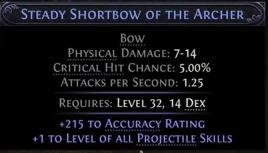 | 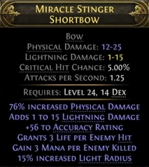 | 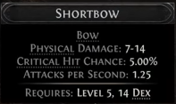|

## Mods / Affixes
Mods, modificadores ou `Affixes` são divididos em duas categorias, `Prefix` e `Suffix`. Os modificadores `Prefix` não podem aparecer como `Suffix` e vice-versa.

  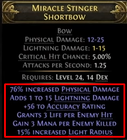

A raridade do item define a quantos `affixes` um item pode ter.

| Comum | Mágico | Raro |
|:---|:---|:---|
| 0 Affixes | 1-2 Affixes | 3-6 Affixes |

## Encantamentos ou implícitos
Os implícitos são mods especiais que vêm embutidos em certos itens, separados dos mods prefixos e sufixos. Esses mods não ocupam espaço nas modificações mágicas, raras ou únicas do item, e são sempre fixos no tipo e no número de mods possíveis para aquele item específico.

⚠️ Os implícitos não podem ser craftados.

  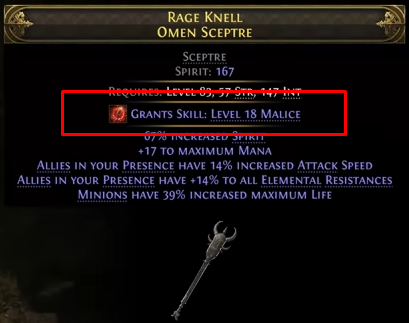

## Qualidade
Influência o status principal do item. Ex.: Dano em armas e defesa / dodge em armaduras.

## Soquetes
Espaço onde pode ser colocado uma `Rune` ou `Soul Core`.
- Não podem ser removidos.
- Máximo de 2 `socket` em armas de duas mãos e peitorais.
- Máximo de 1 `socket` em armas de uma mão e demais peças de armadura.

💎 `Soul Core` oferece buffs diferentes de `Rune` mas funciona da mesma forma. Dropam do `Trial of the Chaos God`, atividade do end-game.

# Mecânicas de crafting básico

## Currency / Itens de crafting
| Img | Item |  Efeito |
|:---|:---|:---|
| Chaos Orb |  | Remove um modificador aleatório e adiciona um modificador aleatório. |
| Divine Orb |  | Randomiza os valores numéricos de um item. |
| Exalted Orb | 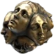 | Adiciona um modificador aleatório a um <ins>item raro</ins>. |
| Orb of Alchemy | 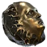 | Atualiza um item <ins>normal</ins> para um item raro com 4 modificadores. |
| Orb of Annulment | 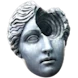 | Remove um modificador aleatório. |
| Orb of Augmentation | 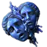 | Adiciona um modificador aleatório a um item <ins>mágico</ins> |
| Orb of Chance |  | Transforma um item <ins>normal</ins> em um item mágico, raro ou único de forma aleatória. |
| Orb of Transmutation | 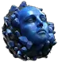 | Transforma um item <ins>normal</ins> em um item mágico com um modificador |
| Regal Orb |  | Transforma um item <ins>normal</ins> em um item raro |
| Vaal Orb | 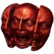 | Modifica o item de forma imprevisível e única. Adiciona [corrupção](#vaal-orb) o item. |

## Progressão simples

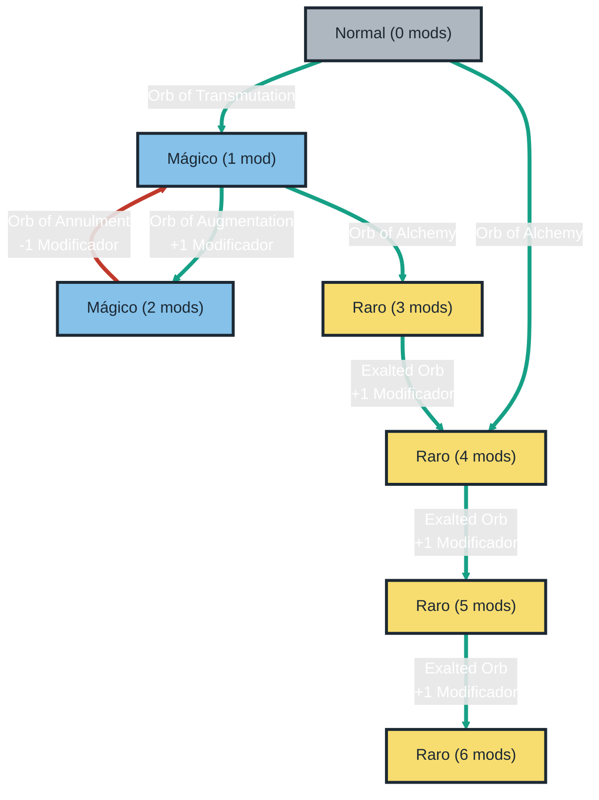

loop HealthCheck
    John->>John: Fight against hypochondria
end

## Chaos Orb
## Vaal Orb

# Crafting no end-game
## Essencias
## 
